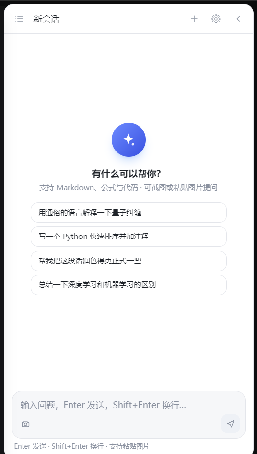
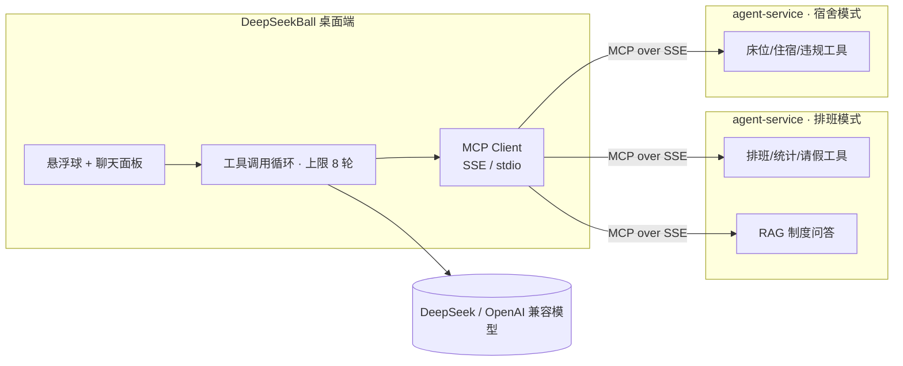

# DeepSeek Ball — 桌面悬浮球 AI 助手

Windows 桌面右侧的可移动悬浮球，点击展开聊天面板。类似 Edge 中「大学搜题酱」的形态，但完全独立于浏览器运行（Electron）。

<p align="center">
  
  
</p>

## 下载体验（免安装）

| 产物 | 说明 | 下载 |
|---|---|---|
| 便携版 | 免安装，双击即用 | [DeepSeekBall-Portable-0.1.0.exe](https://github.com/cjh522225/DeepSeekBall/releases/download/v0.1.0/DeepSeekBall-Portable-0.1.0.exe) |
| 安装版 | NSIS 安装包，可自选目录 | [DeepSeekBall-Setup-0.1.0.exe](https://github.com/cjh522225/DeepSeekBall/releases/download/v0.1.0/DeepSeekBall-Setup-0.1.0.exe) |

> 首次运行需在设置中填写模型 API Key（DeepSeek 官方或任意 OpenAI 兼容端点）。


## 功能特性

- **悬浮球**：始终置顶、可拖动、自动吸附屏幕左右边缘、位置记忆、生成中显示加载动画、右键菜单
- **聊天面板**：流式输出、Markdown / KaTeX 公式 / 代码高亮（含一键复制）、思考过程折叠（推理模型）
- **多会话**：会话列表抽屉、新建 / 重命名（双击标题）/ 删除（两次点击确认）、全文搜索、按时间排序
- **系统集成**：全局快捷键（默认 `Alt+Space` 开关面板、`Alt+Shift+A` 截图提问、`Alt+Shift+Q` 剪贴板提问）、系统托盘、开机自启、深浅色主题
- **游戏/全屏免打扰**：检测前台全屏窗口（游戏、全屏视频等），自动隐藏悬浮球，退出全屏后恢复；可在设置或托盘菜单中关闭（`hideOnFullscreen`）
- **开机自启**：直接写入 `HKCU\...\CurrentVersion\Run` 并校验（含 StartupApproved 启用标记），设置页会显示真实生效状态；应用每次启动会自动校正启动项路径（如更换安装位置）。注意：`npm run dev` 开发模式不支持自启，需使用打包/安装后的应用
- **截图/图片提问**：全屏选区截图 → Windows 内置 OCR 识别为文字（适配 deepseek-chat 等纯文本模型），或直接发送图片给多模态模型；支持 `Ctrl+V` 粘贴图片
- **数据本地化**：会话、附件、配置默认存放于项目目录下的 `data\`（打包版为程序同级 `data\`，见「数据与目录」；可用「打开数据目录」直达）；API Key 使用 Windows DPAPI 加密存储
- **导出**：单会话导出 Markdown、全部数据导出 JSON 备份
- **Provider 可切换**：DeepSeek 官方 API / OpenCode Go / 任意 OpenAI 兼容端点 / 实验性网页模式（复用网页登录态，见下方警告）
- **MCP 客户端（桌面 Agent 宿主）**：集成 Model Context Protocol —— SSE 与 stdio 双传输、服务器增删改查、工具调用循环（上限 8 轮）、写操作界面二次确认、工具调用卡片、MCP 设置页；可连接业务系统（排班 / 宿舍）的 Agent 服务，在桌面端完成跨系统任务（详见下文「MCP 集成」）

## 快速开始（开发）

```bash
cd D:\Projects\deepseek-ball
npm install          # 首次安装依赖（含 Electron 二进制）
npm run dev          # 启动开发模式
```

启动后：
1. 悬浮球出现在屏幕右缘中部；
2. 点击悬浮球展开面板 → 右上角齿轮进入设置；
3. 选择服务并填写 API Key → 保存连接设置 → 测试连接；
4. 开始对话。

### 使用 OpenCode Go（推荐，本机已配置）

设置 → 兼容接口 → 快速配置点击「OpenCode Go」→ 点击「从本机 OpenCode 导入密钥」→ 保存连接设置 → 测试连接（应显示「可用模型 37 个」）。

- 接入地址：`https://opencode.ai/zen/go/v1`（标准 OpenAI 兼容接口）
- 可用模型：`deepseek-v4-flash`、`deepseek-v4-pro`、`minimax-m3`、`kimi-k3`、`glm-5.2`、`qwen3.7-max`、`longcat-2.0` 等 37 个
- 密钥来源：本机 OpenCode 凭证（`~/.local/share/opencode/auth.json`），由应用读取后经 Windows DPAPI 加密保存，不会明文落盘
- 应用会自动附带 OpenCode 路由所需的 `x-opencode-session` / `x-opencode-request` / `x-opencode-client` 请求头

### 使用 DeepSeek 官方 API

设置 → 官方 API → 填写 [platform.deepseek.com](https://platform.deepseek.com) 申请的 API Key，模型选 `deepseek-chat` 或 `deepseek-reasoner`。

## MCP 集成（作为桌面 Agent 宿主）

本应用内置 **MCP（Model Context Protocol）客户端**，可作为桌面侧 Agent 宿主连接业务系统的 MCP Server，
把「本机工具 + 业务系统工具」统一交给模型编排：一次对话完成跨系统任务（例如同时查询排班与宿舍床位）。



### 连接配套的 agent-service（三步）

1. 启动 Agent 服务（默认 `http://localhost:8090`，MCP SSE 端点 `/sse`）：
   获取代码 → [cjh522225/paiban-agent](https://github.com/cjh522225/paiban-agent) 的 `agent-service` 目录，
   按其中 README 启动（`AGENT_MODE=paiban` 连排班系统，`AGENT_MODE=dorm` 连宿舍系统）
2. 本应用：**设置 → MCP 服务器 → 添加**，传输选 `SSE`，地址填 `http://localhost:8090`，启用保存
3. 点击**测试连接**，看到工具列表（如 `currentWeek` / `mySchedule` / `searchPolicy`）后即可在对话中直接提问

> 安全说明：MCP 暴露的均为**只读工具**；聊天中的写操作工具需要界面二次确认后才会执行。

## 常用命令

| 命令 | 说明 |
|---|---|
| `npm run dev` | 开发模式（热更新） |
| `npm run typecheck` | 主进程 / 渲染进程类型检查 |
| `npm test` | Vitest 单元测试（41 个用例，含 MCP 客户端真实 stdio 端到端） |
| `npm run build` | 构建到 `out/` |
| `npm run dist` | 打包安装包（NSIS + 便携版）到 `release/` |

## 打包与安装（D 盘）

- 产物目录：`D:\Projects\deepseek-ball\release`
  - `DeepSeekBall-Setup-<version>.exe`：安装版，安装时可自选目录（默认建议 `D:\Program Files\DeepSeekBall`）
  - `DeepSeekBall-Portable-<version>.exe`：免安装便携版，放到 D 盘任意目录双击运行
- 首次打包前建议把构建缓存指向 D 盘（节省 C 盘空间）：

```powershell
$env:ELECTRON_CACHE='D:\Projects\.cache\electron'
$env:ELECTRON_BUILDER_CACHE='D:\Projects\.cache\electron-builder'
npm run dist
```

### 打包注意事项（本机已内置处理）

- `scripts/patch-7za.ps1`：无管理员权限时 electron-builder 解压 winCodeSign 会因 macOS 符号链接失败，脚本为 7za 增加 `-x!darwin` 转发层
- `scripts/after-pack.cjs`：杀毒软件扫描新生成的 188MB exe 会短暂锁定文件导致 rcedit 失败，该钩子接管图标/版本信息写入并自动重试（最多 60 秒），因此 `win.signAndEditExecutable` 设为 `false`
- `scripts/make-ico.cjs`：从 `resources/icon.png` 生成 `resources/icon.ico` 供写入 exe 图标

## 数据与目录

| 内容 | 位置 |
|---|---|
| 项目源码 | `D:\Projects\deepseek-ball` |
| 运行数据（会话/附件/配置/日志） | 开发模式：`D:\Projects\deepseek-ball\data`；打包/便携版：程序同级的 `data\`（历史版本曾使用 `D:\DeepSeekBall\data`，首次启动会自动迁移；以上均不可用时回退 `%APPDATA%\DeepSeekBall`） |
| 打包产物 | `D:\Projects\deepseek-ball\release` |

数据目录结构：

```
data\
├─ config.json                  # 应用设置
├─ secrets.json                 # API Key（DPAPI 加密）
├─ conversations\               # 会话数据（index.json + 每会话一个 json）
├─ attachments\                 # 截图/粘贴的图片
└─ session\                     # Chromium 会话数据（含网页模式登录态）
```

## 架构速览

```
src/
├─ main/                      # Electron 主进程
│  ├─ windows/                #   ballWindow / panelWindow / capture(overlay)
│  ├─ providers/              #   官方/兼容 API 与实验性网页模式
│  ├─ store/                  #   会话与附件持久化（JSON）
│  ├─ services/ocr.ts         #   Windows.Media.Ocr 桥（PowerShell）
│  ├─ ipc/                    #   IPC 处理器（聊天流式转发、会话、设置、截图）
│  └─ tray.ts / shortcuts.ts  #   托盘与全局快捷键
├─ preload/                   # contextBridge 类型化 API
├─ shared/                    # 主/渲染共享类型
└─ renderer/                  # 三个页面：panel（React 主界面）/ ball / overlay
```

流式对话路径：渲染层 `chat.send` → 主进程 Provider 消费 SSE → `chat:chunk` 事件增量更新 → 完成后落盘并回传 `chat:done`。

## 实验性网页模式（重要警告）

设置 → 网页模式：复用你在 `chat.deepseek.com` 的登录态调用其内部接口，**违反 DeepSeek 服务条款、可能随时失效、极端情况下账号可能受限**。请仅个人测试使用，日常请使用官方 API。对话会映射到本地会话（记录站点会话 ID 以延续上下文）。

## 已知限制

- OCR 依赖系统语言包（中文系统自带 zh-Hans 支持），识别效果受截图质量影响；
- 划词提问采用「全局快捷键 + 剪贴板」实现，不会自动捕获其他应用中的选中文本；
- 全屏检测基于前台窗口是否铺满所在显示器（排除桌面/任务栏等系统窗口），个别带边框的全屏程序可能识别不到，可通过设置关闭该功能；
- 若开机自启未生效：确认运行的是安装版/打包版（开发模式不支持），并在「任务管理器 → 启动应用」中查看 DeepSeekBall 是否被系统或安全软件禁用；
- 多显示器暂只支持主屏吸附与截图（截图跟随鼠标所在屏幕）；
- 长对话未做虚拟滚动，超长会话（>500 条）滚动性能可能下降。
